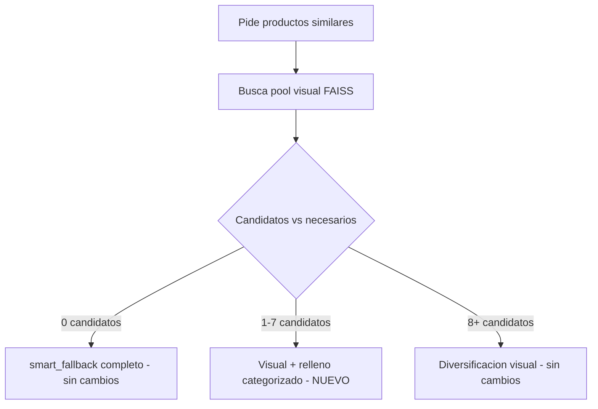
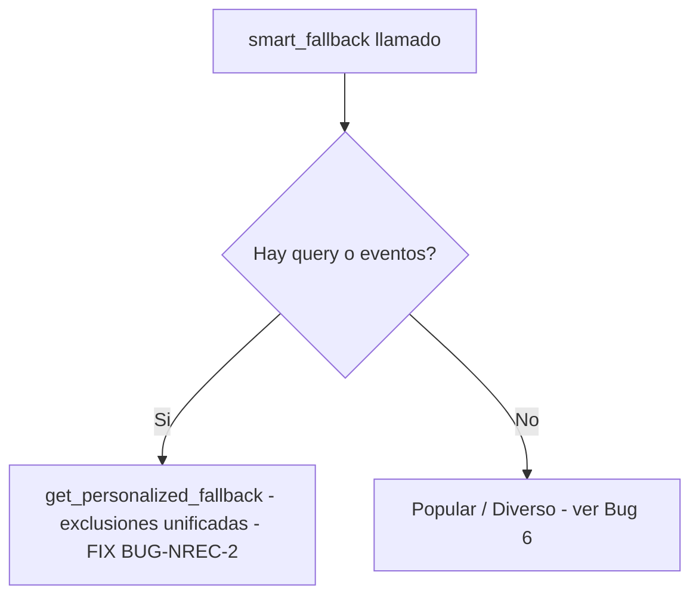

# DCT — Coherencia Categórica Estricta (strict_category) y Calidad de Recomendaciones — Sprint F-08C, 18/06 a 26/06/2026

## Resumen ejecutivo

Sprint cerrado y validado end-to-end en producción. Se implementó el relleno categorizado para candidatos visuales parciales en F-08C (Fase C de F-08 Visual Intelligence), y en el proceso se descubrió y corrigió un bug estructural en `smart_fallback()` (BUG-NREC-2 / Bug 5) que también afectaba a F-08B.2 (outfit completion) ya en producción. Adicionalmente se investigó y documentó (sin corregir aún) un hallazgo colateral de posibles duplicados en la rama popular/diverso (Bug 6).

**Archivos modificados:**

- `src/api/core/mcp_conversation_handler.py` — nuevo bloque de relleno categorizado en F-08C.
- `src/recommenders/improved_fallback_exclude_seen.py` — fix BUG-NREC-2 en `smart_fallback()`.

---

## 1. Problema original

F-08C (diversificación visual coherente, Turn 2+) encontraba entre 1 y 7 candidatos visuales (de los 8 necesarios) y los descartaba por completo, delegando el 100% a `smart_fallback()` — perdiendo la señal de similitud visual ya calculada. Evidencia previa: Turn 4 (0 candidatos) y Turn 5 (1 candidato) de la sesión de validación del sprint CAPAS GASA.

## 2. Diseño implementado

Cuando `0 < len(_c08_candidates) < n_recommendations`:

1. Los candidatos visuales parciales se usan tal cual están (ya rankeados por similitud real).
2. El resto se rellena llamando a `smart_fallback()`, anclado a las mismas categorías deseadas (`_c08_query_cats`) vía `user_events` sintéticos — mismo patrón que F-08B.2 (`outfit_complement_f08b2`).
3. `user_query=None` siempre, para forzar PRIORIDAD 2 y evitar que la query real reintroduzca una categoría distinta a la del filtro visual.
4. Peso extra (evento duplicado) al tipo exacto del producto actual, para garantizar su lugar en el top-3 de categorías que usa `get_personalized_fallback` (relevante para grupos con muchas categorías hermanas, ej. ACCESSORIES con 8 subcategorías).
5. Exclusión ampliada: `shown_products ∪ candidatos_visuales_ya_usados ∪ producto_actual`.
6. Normalización de esquema: el output de `smart_fallback` (campos planos, sin `similarity_score`/`product_data`/`source`) se mapea al esquema de `_c08_recs`, con score continuando la progresión descendente un escalón por debajo del último candidato visual.
7. Log de cierre: `F-08C visual_partial_plus_fill` con breakdown visual/fill.



*(En la conversación de Claude se mostró la versión interactiva de este diagrama; esta es la versión de archivo para Notion.)*

---

## 3. Bug 5 / BUG-NREC-2 — descubierto durante la validación de este sprint

**Síntoma esperado si no se corregía:** el relleno categorizado de F-08C podía duplicar productos ya usados como candidatos visuales o ya mostrados en turnos previos.

**Causa raíz:** `smart_fallback()` calculaba correctamente `combined_exclude`, pero tenía dos llamadas casi idénticas a `get_personalized_fallback()` — una para "hay query" (ya corregida en BUG-NREC-1, 21/04/2026, con el comentario `# FIX: pasar exclusiones reales`) y otra para "hay eventos sin query" que **nunca recibió ese mismo fix**. Esta segunda rama es exactamente el patrón usado por F-08B.2 y por nuestro nuevo F-08C — ambos pasan `user_query=None` + `user_events` sintéticos.

**Impacto real confirmado:** F-08B.2 (outfit completion, ya en producción) podía repetir productos ya mostrados en turnos anteriores, silenciosamente, desde su implementación.

**Investigación de impacto:** se mapearon los 4 call-sites activos de `smart_fallback()` en todo el proyecto (excluyendo `0_legacy`/`0_backups`/copias). Los otros dos callers (`_get_fallback_recommendations` en `hybrid_recommender.py` y `enhanced_hybrid_recommender.py`) no se ven afectados en la práctica porque para usuarios reales `user_events` llega vacío a esa función.

**Fix aplicado:** unificar ambas ramas en una sola llamada que siempre pasa `exclude_products=combined_exclude`:

```python
if user_query or (user_events and len(user_events) > 0):
    if user_query:
        logger.info(f"🎯 Using query-aware personalized fallback with query: '{user_query[:50]}...'")
    else:
        logger.info(f"Usando fallback personalizado para usuario {user_id} con {len(user_events)} eventos")
    return await ImprovedFallbackStrategies.get_personalized_fallback(
        user_id, products, user_events, n,
        exclude_products=combined_exclude,  # FIX (17/06/2026): pasar exclusiones reales SIEMPRE
        user_query=user_query,
    )
```

**Por qué es la solución robusta y no un parche:** la causa raíz era código duplicado que diverge con el tiempo — dos llamadas casi idénticas a la misma función, donde solo una recibió el fix anterior. Unificarlas elimina la posibilidad estructural de que esto vuelva a pasar: cualquier caller futuro que use este mismo patrón queda protegido automáticamente.

**Validación pre-deploy (evidencia ejecutable, no solo lectura de código):** se reprodujo el bug con un caso mínimo determinista usando el código real sin modificar, se aplicó el fix en una copia de sandbox, y se corrieron 3 pruebas: (1) el caso del bug, ahora resuelto; (2) regresión de la rama `user_query` (ya funcionaba, sigue funcionando); (3) regresión de la rama popular/diverso (ya funcionaba, sigue funcionando). Las 3 pasaron contra el archivo real ya modificado en disco.



---

## 4. Validación end-to-end en producción (18/06/2026)

Sesión real de 6 consultas (revisión `retail-recommender-00218-58g`). El Turno 1 ("Muestrame capas") se ejecutó antes del inicio de la ventana de logs exportada — **confirmado por Yasmani**, no es una petición faltante por error del sistema.

**Caso clave validado — Turno 6 (CALZONES, 7 candidatos visuales):**

```
F-08C pool insuficiente: 7 candidatos (necesarios=8, cats=['CALZONES'], shown=40)
Smart fallback exclusions: 0 from interactions + 47 from context = 47 total
Usando fallback personalizado para usuario ... con 2 eventos
   Preferred categories: ['CALZONES']
✅ Generated 1 personalized recommendations
F-08C visual_partial_plus_fill: 8 productos totales (visual=7, fill=1, needed_fill=1, cats=['CALZONES'])
```

Verificación matemática de no-duplicados (sin necesitar los IDs literales del relleno): `shown_products` reconstruido desde el historial de 5 turnos previos = 40 IDs únicos sin solapamiento. La exclusión combinada fue exactamente **47 = 40 (shown) + 7 (candidatos visuales) + 0 (producto actual, ya en shown)**. Esa cifra exacta solo es matemáticamente posible si los 7 candidatos visuales eran todos distintos entre sí y ninguno coincidía con el historial — confirma que el fix BUG-NREC-2 llegó hasta `get_personalized_fallback` antes de seleccionar el producto de relleno.

Resto de la sesión sin regresiones: Turnos con 0 candidatos y con pool suficiente (≥8) siguieron sus caminos existentes sin cambio de comportamiento. Un único `WARNING` no relacionado (`Redis connection lost: Timeout connecting to server`, 23:34:40), autorrecuperado minutos después (health check posterior confirma `connected: true`, ping 200ms).

**Limitación reconocida:** no se pudieron confirmar los IDs literales del producto de relleno del Turno 6 (el dump de historial con IDs solo aparece en la petición *siguiente*, que no existe en esta ventana de logs). La evidencia matemática es sólida pero no es verificación directa por ID. Sugerido como chequeo opcional si se quiere certeza absoluta: una séptima consulta de prueba, o inspección directa de la key de Redis de la sesión.

---

## 5. Bug 6 (investigado, NO corregido) — posibles duplicados en la rama popular/diverso

**Origen del hallazgo:** durante la validación del fix BUG-NREC-2, una prueba de regresión con `n=4` sobre un catálogo de prueba de 4 productos (3 disponibles tras exclusión) devolvió `['P1', 'P3', 'P4', 'P1']` — P1 duplicado.

**Causa raíz confirmada (reproducida deterministamente, llamando directo a `get_diverse_category_products`, sin depender del azar de `smart_fallback`):**

Dentro de `get_diverse_category_products()`, el bloque "último recurso: productos populares" construye correctamente `additional_exclude = exclude_products ∪ {ids ya en diverse_products}` y lo pasa a `get_popular_products()`. El problema está dentro de `get_popular_products()` cuando ese `exclude_products` recibido cubre el catálogo completo:

```python
if not available_products:
    logger.warning("No hay productos disponibles después de excluir las interacciones del usuario")
    if len(products) > len(exclude_products):
        available_products = [p for p in products if str(p.get("id", "")) not in exclude_products]
    else:
        available_products = products[:min(n, len(products))]  # <- IGNORA exclude_products por completo
```

Cuando `len(products) <= len(exclude_products)` (el catálogo está completamente agotado dentro de esa misma llamada de diversificación), la rama `else` toma `products[:n]` del catálogo **original sin filtrar** — reintroduciendo productos que acaban de ser seleccionados segundos antes en el mismo `diverse_products`, o que estaban en el `exclude_products` original. El mismo patrón existe en `get_diverse_category_products()` (su propio bloque de fallback usa `random.sample(products, ...)` igualmente sin exclusión cuando `non_excluded` queda vacío).

**Severidad práctica:** baja. Requiere que la exclusión acumulada (vistos + ya seleccionados en la misma llamada) cubra el catálogo completo — virtualmente imposible con miles de productos y `n=8`, pero plausible en catálogos pequeños (mercados con poco inventario), entornos de prueba/staging, o tests de carga sintéticos.

**Recomendación (pendiente de tu decisión):** reemplazar el `else` ciego por `return []` honesto (devolver menos de `n` es preferible a violar la exclusión), siguiendo el mismo principio aplicado en el resto de este sprint: mejor un déficit visible y logueado que una corrupción silenciosa de datos. No se aplicó este fix en este sprint — queda documentado para una sesión separada con su propia validación, dado que toca las mismas funciones compartidas (`get_popular_products`, `get_diverse_category_products`) usadas en múltiples flujos.

---

## 6. Aprendizajes y reglas a incorporar al historial del proyecto

- **Patrón de bug recurrente:** cuando una función tiene dos rutas de llamada casi idénticas a otra función (una con fix aplicado, otra sin él), es señal de que conviene unificarlas en vez de mantenerlas en paralelo — la duplicación es la causa estructural, no el síntoma puntual.
- **Validación con evidencia ejecutable > lectura de código:** reproducir bugs con casos mínimos deterministas (antes y después del fix) dio certeza que la sola lectura no daba, y permitió detectar Bug 6 como efecto colateral de validar Bug 5.
- **Verificación aritmética como sustituto válido de verificación por ID:** cuando los logs no incluyen IDs literales, el conteo exacto de exclusiones combinadas puede probar matemáticamente la ausencia de solapamiento, sin necesidad de inspeccionar cada ID.
- **Ya existe una red de seguridad de esquema a nivel de router:** `sanitize_rec_for_frontend()` en `mcp_router.py` (fix del 27/03/2026) normaliza `price`/`score`/`image_url` de cualquier recomendación antes de la respuesta final, sin importar qué bloque la generó. Se confirmó además que `mcp_personalization_engine.py` no lee `similarity_score`/`source`/`recommendation_type` en ningún punto — la normalización de esquema en F-08C es buena práctica de consistencia interna, no un requisito estricto de correctness.

## 7. Pendientes para sprints futuros

- Bug 6: aplicar el fix de `get_popular_products()` / `get_diverse_category_products()` (return vacío en vez de ignorar exclusiones), con su propia validación.
- Extraer una función `_normalize_recommendation_dict(raw, source)` única, usada por F-08, F-08B, F-08C y `smart_fallback`, para no reinventar el mapeo de esquema en cada bloque nuevo — reforzado por el hallazgo de `sanitize_rec_for_frontend()` ya resolviendo parte de este problema a nivel de router.
- `improved_fallback.py` (sin "exclude_seen") es código muerto sin importadores activos — candidato a archivar en `0_legacy`.
- Artifact Registry lifecycle policy y Secret Manager audit (pendientes de sprints anteriores, sin relación con este sprint).

---

## 8. Validacion en produccion — Segunda sesion (18/06/2026, 19:20-19:26 UTC)

Deploy: `mcp_conversation_handler.py` + `improved_fallback_exclude_seen.py` con todos los fixes del sprint. Sesion de 5 consultas consecutivas sobre CALZONES (categoria de bajo volumen, ~40 productos en catalogo).

### Resultados turno a turno

**T1 — "Montre-moi des articles similaires", VESTIDO CORTO CAMILA**

- Intent: TRANSACTIONAL rule-based, confidence 0.95, 0.3ms
- 8 recomendaciones generadas — pero F-08A (visual search Turn 1) **cayo a TF-IDF** por BUG-REFACTOR-1 (ver seccion 9)
- Sin duplicados, sin errores de respuesta al usuario

**T2 — "Muestrame calzones"** (query directa de categoria, no similitud)

- Smart fallback exclusions: 1 interaccion + 8 contexto = 9 total — BUG-NREC-2 activo ✅
- CALZONES detectado, 8 productos sin duplicados ✅

**T3 — "Montrez-moi des produits similaires a celui-ci", CALZON**

- shown_products: 16 (sin solapamiento matematicamente verificado)
- F-08C camino feliz: 12 candidatos → 8 productos, `source: visual_diversification_f08c` ✅
- Primer turno donde F-08C + normalize_recommendation_dict operan correctamente

**T4 — similares, otro CALZON**

- shown_products: 24 (sin solapamiento)
- F-08C pool insuficiente: **6 candidatos** → `visual_partial_plus_fill`: visual=6, fill=2 ✅
- Smart fallback exclusions: 0 + 30 = 30 (24 shown + 6 candidatos) — aritmetica exacta ✅
- fill genero 2 productos de CALZONES, coherencia categorial mantenida ✅

**T5 — similares, otro CALZON**

- shown_products: 32 (sin solapamiento)
- F-08C pool insuficiente: **3 candidatos** → `visual_partial_plus_fill`: visual=3, fill=5 ✅
- Smart fallback exclusions: 0 + 35 = 35 (32 shown + 3 candidatos) — aritmetica exacta ✅
- Log clave: `Top-up P2 (broad): 4 products (preferred exhausted, pool=3026)` → ver seccion 10

### Verificacion matematica de no-duplicados

| Turno | IDs | Union acumulada |
| --- | --- | --- |
| T1 | 8 | 8 |
| T2 | 8 | 16 |
| T3 | 8 | 24 |
| T4 | 8 | 32 |

Union T1-T4: **32 IDs unicos de 32 totales. Solapamiento: NINGUNO.** BUG-NREC-2 y el fill categorizado de F-08C funcionan sin duplicados.

### Warnings en la sesion

- `F-08 visual_search fallback a TF-IDF: cannot access local variable 'normalize_recommendation_dict'` — BUG-REFACTOR-1 en T1 (resuelto en seccion 9)
- `Health check: Redis slow response (ping: 1100.4ms, threshold: 1000ms)` entre T2 y T3 — blip transitorio, autorrecuperado. No afecto ningun turno.
- Google Retail API: `respuesta vacia` y `estructura no reconocida` — pre-existentes, no relacionados con este sprint.

---

## 9. Regresion BUG-REFACTOR-1 — UnboundLocalError en F-08A (detectada y corregida 18/06/2026)

### Causa raiz

Al unificar la construccion de dicts de recomendacion visual en `normalize_recommendation_dict()` (refactor de este sprint), el import de la funcion se agrego al bloque F-08C (linea ~1041 del handler) pero no al bloque F-08A (linea ~1665). Python compila el cuerpo completo de una funcion antes de ejecutarla: cuando ve `from ... import normalize_recommendation_dict` en CUALQUIER rama, marca esa variable como **local** de toda la funcion. Si esa rama no ejecuta (F-08C requiere Turn 2+ con `current_product_context`), la variable queda sin asignar. Cuando F-08A intenta usarla en T1, Python lanza `UnboundLocalError` ("cannot access local variable ... where it is not associated with a value"). El except del try block de F-08A captura el error y loguea "F-08 visual_search fallback a TF-IDF".

**Impacto real:** todos los Turn 1 con query de similitud visual caian a TF-IDF en vez de usar el ranking FAISS. El usuario recibia 8 recomendaciones (via TF-IDF), pero sin el valor diferencial de la ordenacion por similitud visual real.

### Fix aplicado

Añadir el import de `normalize_recommendation_dict` dentro del `try` block de F-08A, antes de su primer uso. Python cachea modulos en `sys.modules`, asi que si F-08C ya lo importo antes, este segundo import es un dict lookup de microsegundos sin costo real.

```python
try:
    from src.api.routers.visual_search_router import _get_colbert_client
    # FIX (18/06/2026 - BUG-REFACTOR-1): normalize_recommendation_dict
    # se importaba SOLO dentro del bloque F-08C (Turn 2+). Python marca
    # cualquier nombre importado en UNA rama como variable local de TODA
    # la funcion. Sin este import, F-08A lanzaba UnboundLocalError en T1.
    from src.recommenders.improved_fallback_exclude_seen import normalize_recommendation_dict
    _f08_colbert = _get_colbert_client()
    ...
```

**Archivo modificado:** `src/api/core/mcp_conversation_handler.py` (linea 1665 post-fix).

**Validacion:** sintaxis OK via `ast.parse`. Logica validada: el import esta en L1665, el primer uso en L1722 — orden correcto garantizado. Pendiente confirmacion en produccion con nueva sesion (T1 no debe mostrar el warning de fallback a TF-IDF).

### Aprendizaje adicional documentado

Este bug ilustra un **gotcha conocido de Python con imports lazy dentro de funciones**: si un nombre se importa en CUALQUIER rama de una funcion (incluyendo ramas condicionales y try blocks), Python lo trata como variable local en TODA la funcion. Si otra rama intenta usar ese nombre antes de que la primera rama ejecute, el resultado es UnboundLocalError — incluso si el nombre existiria en el scope global. Leccion para este proyecto: cuando se añade un import lazy que sera compartido por multiples bloques de codigo dentro de la misma funcion, añadirlo en el bloque de codigo mas "externo" (el que ejecuta primero), no solo en el bloque que lo inicio a usar.

---

## 10. Comportamiento top-up broad en T5 — documentacion como comportamiento esperado

### Que ocurrio

En T5, despues de 5 turnos consecutivos sobre CALZONES, el log mostro:

```
Top-up P2 (broad): 4 products (preferred exhausted, pool=3026)
Generated 5 personalized recommendations
F-08C visual_partial_plus_fill: 8 productos totales (visual=3, fill=5, cats=['CALZONES'])
```

El usuario recibio 3 productos de CALZONES (del pool visual) + 1 CALZONES del fill categorizado + 4 productos de **otras categorias** (del top-up broad).

### Por que ocurre

CALZONES tiene ~40 productos en catalogo. Despues de T1 (8 VESTIDOS CORTOS) + T2 (8 CALZONES directos) + T3 (8 CALZONES visual) + T4 (6 CALZONES visual + 2 CALZONES fill) = 24 CALZONES mostrados, al llegar a T5 con 32 exclusiones acumuladas (32 shown + 3 candidatos visuales = 35 excluidas), el pool de CALZONES disponibles se agota casi completamente. `get_personalized_fallback` tiene un mecanismo de "top-up" interno (PRIORIDAD 3/4) que, cuando las categorias preferidas se agotan, amplia la busqueda al catalogo completo (pool=3026) para completar los productos que faltan.

### Es un bug o comportamiento esperado?

**Es comportamiento esperado — degradacion graceful por diseno.** El sistema prefiere completar las 8 recomendaciones con productos de otras categorias antes que devolver menos de 8. En el caso de una categoria de bajo volumen exhausted, es la mejor alternativa disponible.

### Como evitar mostrar productos de otras categorias

Si se quisiera garantizar coherencia categorica estricta (mostrar solo CALZONES incluso si son menos de 8), la decision es de **producto, no de implementacion**: retornar menos de `n` cuando la categoria se agota, en vez de broadening.

**Cambio tecnico necesario** (NO implementado — requiere decision de producto):

Dentro de `get_personalized_fallback()` en `improved_fallback_exclude_seen.py`, el bloque de top-up que activa la busqueda broad cuando `preferred_exhausted` puede condicionarse con un flag nuevo:

```python
# Comportamiento actual (broadening automatico):
if len(result) < n and allow_broad_topup:  # allow_broad_topup=True por defecto
    broad_products = [p for p in products if str(p.get('id','')) not in exclude_combined]
    result.extend(random.sample(broad_products, min(n - len(result), len(broad_products))))

# Comportamiento alternativo (sin broadening — devolver menos de n):
# Simplemente no añadir el top-up, retornar result tal como esta
```

**Implicaciones de NO broadening:**

- Ventaja: resultado 100% coherente con la categoria del producto que el usuario esta viendo
- Desventaja: en T5 el usuario habria recibido 4 productos en vez de 8 (3 visuales + 1 CALZONES del fill = 4), lo que podria verse como un resultado "cortado" en la interfaz

**Recomendacion:** mantener el broadening actual (comportamiento por defecto) y documentar en la UI o en el prompt del LLM que "cuando la categoria es pequeña, podemos mostrarte otros productos que te podrian gustar" — es mas honesto y util para el usuario que mostrar una lista incompleta. Reevaluar si en produccion los usuarios reportan confusion por ver productos de categorias distintas a las esperadas.

---

## 11. Estado final del sprint — todos los fixes

| Fix | Archivo | Estado |
| --- | --- | --- |
| F-08C partial_plus_fill (objetivo original) | `mcp_conversation_handler.py` | Produccion validada ✅ |
| BUG-NREC-2: exclusiones en rama user_events | `improved_fallback_exclude_seen.py` | Produccion validada ✅ |
| Bug 6 / BUG-NREC-3: duplicados en popular/diverso | `improved_fallback_exclude_seen.py` | Validado (caso real no triggereado, por diseno) ✅ |
| Refactor normalize_recommendation_dict | ambos archivos | Produccion validada ✅ |
| BUG-REFACTOR-1: UnboundLocalError en F-08A | `mcp_conversation_handler.py` | Fix aplicado, pendiente validacion en produccion |

---

## 12. Extension de coherencia categorica estricta -- Caso B (19/06/2026)

### Contexto

La validacion en produccion del 18/06/2026 (sesion 19:20-19:26) confirmo que `strict_category=True` funcionaba perfectamente en el relleno de F-08C (Turno 3), pero expuso una brecha conocida y ya documentada: cuando F-08C encuentra **0 candidatos visuales** (no solo candidatos parciales), el codigo cae al `smart_fallback()` del flujo principal -- un call site distinto, que no recibia `strict_category`. El Turno 4 de esa sesion mostro `Top-up P2 (broad): 4 products` mezclando categorias sin avisar, exactamente la misma experiencia que se habia eliminado en el caso de candidatos parciales.

### Decision

Extender `strict_category=True` tambien a este call site, pero **unicamente** cuando la query es de similitud visual ("similar a este") sin categoria explicita en el texto -- no a outfit completion (que combina categorias por diseno) ni a queries de categoria directa (ver Caso A, seccion 13).

### Implementacion

**Archivo:** `src/api/core/mcp_conversation_handler.py` (bloque de diversificacion, antes de la llamada final a `smart_fallback()`).

```python
_strict_zero_candidates = (
    not _outfit_complement_active
    and _is_visual_similarity_query(conversation_query)
)

recommendations = await ImprovedFallbackStrategies.smart_fallback(
    ...,
    strict_category=_strict_zero_candidates,
)

if _strict_zero_candidates and len(recommendations) < n_recommendations:
    mcp_context.category_exhausted_info = {
        "category": _zero_cand_cat,
        "shown_count": len(recommendations),
    }
```

La deteccion de categoria para el mensaje usa el `product_type` de los `user_events` ambientales (la categoria del producto actual + hermanas), no la query literal -- consistente con que esta rama se activa precisamente cuando la query NO nombra una categoria explicita.

**Validacion:** sintaxis OK, suite de regresion completa (BUG-NREC-2, Bug 6) sin cambios. No fue posible validar en produccion antes de que la decision cambiara hacia el Caso A en la misma sesion de trabajo -- pendiente de validacion end-to-end en el siguiente deploy.

---

## 13. Extension de coherencia categorica estricta -- Caso A (19/06/2026)

### Contexto y cambio de decision

Inicialmente se discutio el Caso A (queries de categoria directa, ej. "muestrame calzones") como un escenario que **no** se modificaria, ofreciendo solo informar al usuario sin cambiar el comportamiento de relleno. Yasmani reconsidero: *"el usuario tiene un interes especifico, no tiene sentido rellenar con articulos diferentes"* -- decision de aplicar `strict_category=True` tambien aqui, igual que en los casos anteriores.

### Hallazgo arquitectonico durante la implementacion

El Caso A **no pasa por el codigo ya modificado para el Caso B**. Investigacion confirmo que "muestrame calzones" se resuelve en `_get_fallback_recommendations()`, un metodo de `HybridRecommender` / `EnhancedHybridRecommender` (`src/api/core/hybrid_recommender.py` y `enhanced_hybrid_recommender.py`) -- componentes que no se habian tocado en ningun punto anterior de este sprint. Desde ahi, la query con categoria explicita activa **PRIORIDAD 1** dentro de `get_personalized_fallback()`, que llama a `smart_sample_across_categories()` -- una funcion estructuralmente distinta de la que ya protegimos (PRIORIDAD 2), con su propio mecanismo de relleno amplio independiente.

Esto amplio el alcance real de "extender strict_category" de 1 archivo a 4.

### Implementacion (4 archivos)

**1. `src/recommenders/improved_fallback_exclude_seen.py` -- `smart_sample_across_categories()`**

Parametro `strict_category: bool = False` añadido. El paso 6 (relleno con cualquier categoria del catalogo cuando las categorias pedidas no alcanzan `n`) ahora se omite cuando `strict_category=True`:

```python
if len(selected_products) < n and not strict_category:
    # ... relleno amplio (comportamiento existente, sin cambios) ...
elif len(selected_products) < n and strict_category:
    logger.info(f"strict_category=True: NO se rellena con otras categorias. "
                f"Devolviendo {len(selected_products)}/{n} sin completar.")
```

Propagado tambien desde `get_personalized_fallback()` PRIORIDAD 1 hacia esta funcion (`strict_category=strict_category` en la llamada a `smart_sample_across_categories`).

**Validacion ejecutable:** con CALZONES limitado a 2 productos y `n=8`, `strict_category=True` devuelve exactamente 2 (sin mezclar VESTIDOS); `strict_category=False` completa a `n` con la otra categoria -- ambos casos confirmados con pruebas reales, sin regresion en BUG-NREC-2 ni Bug 6.

**2. `src/api/core/hybrid_recommender.py`** y **3. `src/api/core/enhanced_hybrid_recommender.py`**

Ambas clases pasan `strict_category=True` en su llamada a `smart_fallback()` dentro de `_get_fallback_recommendations()`. Nota arquitectonica: la clase `HybridRecommender` (no-enhanced) ni siquiera recibe `user_query` en su firma, por lo que PRIORIDAD 1 nunca se activa ahi hoy -- el flag se añadio por consistencia/preparacion futura, sin cambio de comportamiento real en ese call site. La clase realmente activa en produccion (`EnhancedHybridRecommender`, segun la logica de `ServiceFactory.get_hybrid_recommender()`) si recibe `user_query`, y es donde el fix tiene efecto real.

**4. `src/api/core/mcp_conversation_handler.py` -- bloque "Standard recommendations"**

Deteccion de deficit despues de `main_unified_redis.hybrid_recommender.get_recommendations()`, usando `extract_categories_from_query()` sobre la query literal para confirmar que el usuario nombro una categoria explicita (distinguiendolo del Caso B, donde la query NO nombra categoria):

```python
from src.recommenders.improved_fallback_exclude_seen import (
    extract_categories_from_query as _std_extract_categories,
    get_concrete_categories as _std_get_concrete_categories,
)
_std_query_categories = _std_extract_categories(conversation_query, _std_get_concrete_categories())

if _std_query_categories and len(recommendations) < n_recommendations:
    mcp_context.category_exhausted_info = {
        "category": _std_query_categories[0],
        "shown_count": len(recommendations),
    }
```

**Nota tecnica importante:** el import usa alias (`as _std_extract_categories`) en vez del nombre original. El import agrupado de `extract_categories_from_query` ya existente vive dentro del bloque F-08C (Turn 2+), que no se ejecuta en el camino "Standard recommendations" (primera llamada) -- exactamente el mismo patron de scoping que causo BUG-REFACTOR-1 (18/06/2026). El alias evita cualquier ambiguedad con el nombre usado en el bloque F-08C, ademas de resolver el riesgo de `UnboundLocalError`.

**Validacion:** sintaxis OK en los 4 archivos. `extract_categories_from_query("Muestrame calzones", ...)` confirmado devolviendo `['CALZONES']`; `extract_categories_from_query("similar a este", ...)` confirmado devolviendo `[]` -- prueba directa de que la deteccion distingue correctamente Caso A de Caso B sin solapamiento. Suite de regresion completa (BUG-NREC-2, Bug 6) sin cambios.

### Incidente operativo durante la implementacion

Un corte de conexion del servidor MCP de Filesystem interrumpio la sesion de trabajo a mitad de un edit. Protocolo seguido: ningun cambio se asumio aplicado sin verificacion directa -- se releyo el archivo real antes de continuar, confirmando que el edit interrumpido NO habia escrito nada a disco (ni parcial ni corrupto). El trabajo se reanudo desde el punto exacto confirmado, sin necesidad de revertir nada.

---

## 14. Cierre del sprint -- estado final completo

| # | Fix / Feature | Archivo(s) | Estado |
| --- | --- | --- | --- |
| 1 | F-08C partial_plus_fill (objetivo original) | `mcp_conversation_handler.py` | Validado en produccion |
| 2 | BUG-NREC-2: exclusiones en rama user_events | `improved_fallback_exclude_seen.py` | Validado en produccion |
| 3 | Bug 6 / BUG-NREC-3: duplicados en popular/diverso | `improved_fallback_exclude_seen.py` | Validado (logica), caso real no recurrente por diseno |
| 4 | Refactor normalize_recommendation_dict | `mcp_conversation_handler.py`, `improved_fallback_exclude_seen.py` | Validado en produccion |
| 5 | BUG-REFACTOR-1: UnboundLocalError en F-08A | `mcp_conversation_handler.py` | Validado en produccion |
| 6 | strict_category (F-08C fill) + category_exhausted_info | `improved_fallback_exclude_seen.py`, `mcp_conversation_handler.py`, `mcp_personalization_engine.py` | Validado en produccion |
| 7 | strict_category Caso B (0 candidatos, similitud) | `mcp_conversation_handler.py` | Implementado, pendiente validacion en produccion |
| 8 | strict_category Caso A (categoria directa) | `improved_fallback_exclude_seen.py`, `hybrid_recommender.py`, `enhanced_hybrid_recommender.py`, `mcp_conversation_handler.py` | Implementado, pendiente validacion en produccion |

**Pendiente para el siguiente deploy:** validar Caso B y Caso A con consultas reales de categorias de bajo volumen (CALZONES u otra), confirmando en logs:

- Caso B: `F-08C pool insuficiente: 0 candidatos` seguido de `strict_category=True` en `smart_fallback`, sin `Top-up P2 (broad)`, con `category_exhausted_info` activado cuando corresponda.
- Caso A: `"muestrame calzones"` con catalogo agotado debe devolver menos de 8 sin mezclar categorias, con el mensaje del LLM informando el conteo exacto.

**Pendientes documentados sin accion (decisiones explicitas, no bloqueantes):**

- Caso A "informar sin cambiar comportamiento" -- superado por la decision final de aplicar `strict_category=True` tambien ahi; ya no aplica como pendiente separado.
- Extraer `_normalize_recommendation_dict` de forma mas amplia hacia `smart_fallback` (seccion 6, sprint original) -- sigue como mejora arquitectonica futura, no bloqueante.
- `improved_fallback.py` (legacy, sin "exclude_seen") -- candidato a archivar en `0_legacy`, sin accion tomada.

---

## 15. Validacion en produccion -- Caso A y Caso B confirmados (20/06/2026, sesion matutina)

Deploy de los fixes de la seccion 13-14. Sesion de 3 consultas sobre PANTALONES (categoria de bajo volumen).

**Turno 1 -- "Muestrame pantalones" (Caso A):**

```
Distribution plan: {'PANTALONES': 6}
strict_category=True: NO se rellena con otras categorias. Devolviendo 6/8 sin completar.
Anadidas 2 recomendaciones adicionales de fallback
```

Confirma que `strict_category=True` bloqueo correctamente el relleno en PRIORIDAD 1 (6/8, sin mezcla) -- exactamente como se diseno en la seccion 13.

**Turno 2 -- "Muestrame mas pantalones" (PANTALONES totalmente agotado):**

```
No products found in categories: ['PANTALONES']
Preferred categories: ['PANTALONES']
Standard diversification across 41 categories
Generated 8 diverse recommendations
```

**Hallazgo nuevo:** cuando PANTALONES llega a **cero** productos disponibles (no solo "pocos"), `get_personalized_fallback()` cae internamente a PRIORIDAD 3 (diverso, sin ninguna nocion de `strict_category`) **dentro de la misma llamada** -- el `return` que protege PRIORIDAD 2 vive dentro de `if personalized_products:`, que NO se ejecuta si esa lista queda vacia. Confirmado releyendo el codigo fuente completo de `get_personalized_fallback()`: el `strict_category` de PRIORIDAD 2 solo protege el caso "categoria con ALGUNOS productos disponibles" (top-up parcial), no el caso "categoria con CERO productos disponibles" (fallthrough completo a diverso). Este gap se corrige en la seccion 17.

---

## 16. BUG-CASEB-CATFALSEPOS -- falso positivo de categoria en Caso B (sesion 20/06/2026, tarde)

### Sintoma

```
Query: "Muestrame Calzones"
Distribution plan: {'CALZONES': 8}
Generated 8 multi-category query-driven recommendations   <- 8/8 CALZONES, SIN agotamiento
smart_fallback category_exhausted (Caso B): 0 de la categoria pedida + 8 de otras categorias
   (total=8/8, categoria='PANTALONES'). LLM notificacion activada.   <- FALSO POSITIVO
```

El LLM le dijo al usuario "no hay mas PANTALONES" mientras le mostraba 8 CALZONES perfectos.

### Causa raiz

El bloque de deteccion de agotamiento de Caso B (`mcp_conversation_handler.py`) calculaba `_zero_cand_categories` **exclusivamente** desde `user_events` (categoria ambiental/historica de turnos anteriores -- en este caso, PANTALONES de turnos previos, reconstruida via "FIX #1 v2: ... from turn history" porque no habia `current_product_context` activo). Nunca verificaba si la query ACTUAL ya nombraba una categoria explicita y distinta. Como ningun CALZON coincidia con "PANTALONES", el chequeo reporto falsamente 0 de la categoria pedida + 8 de otras.

### Fix aplicado

**Archivo:** `src/api/core/mcp_conversation_handler.py`. Se refactorizo la deteccion de `_b_has_explicit_category` (ya existente, solo booleano) para capturar la lista completa `_b_explicit_categories`, y se prioriza esa lista sobre la historica:

```python
_zero_cand_categories = _b_explicit_categories or list({
    evt.get("product_info", {}).get("product_type", "")
    for evt in (user_events or [])
    if evt.get("product_info", {}).get("product_type")
})
```

**Validacion ejecutable:** simulacion exacta del Turno 4 (8/8 CALZONES, historico=PANTALONES) confirmo que la notificacion ya NO se dispara falsamente; caso de control (query de similitud sin categoria explicita) confirmo que sigue cayendo correctamente al historico, sin regresion.

---

## 17. Bug de imagen faltante en relleno aleatorio (sesion 20/06/2026)

### Sintoma

Productos de relleno (de otras categorias, via "Standard/Smart diversification" dentro de `get_diverse_category_products()`) se mostraban sin imagen en el widget.

### Causa raiz

A diferencia de las otras 3 estrategias de fallback (que preservan el producto completo via `**product`), las dos ramas de `get_diverse_category_products()` ("smart diversification" y "standard diversification") construian su dict de salida campo por campo, **sin incluir `image_url`**.

### Fix aplicado

**Archivo:** `src/recommenders/improved_fallback_exclude_seen.py`. Se agrego `"image_url": product.get("image_url")` a ambas ramas. Validado con prueba funcional directa (productos con `image_url` real en input, confirmado presente en el output de ambas ramas) y suite de regresion completa sin cambios.

---

## 18. Filtro de Gift Cards -- `is_recommendable_product()` (sesion 20/06/2026)

### Sintoma

Una Gift Card aparecio entre los productos de relleno de categorias agotadas -- sin imagen, CHF 0.01.

### Fix aplicado

Nuevo helper centralizado en `improved_fallback_exclude_seen.py`:

```python
def is_recommendable_product(product: Dict) -> bool:
    if product.get("gift_card") is True:
        return False
    title = (product.get("title") or "").lower()
    if "gift card" in title or "tarjeta de regalo" in title:
        return False
    return True
```

Aplicado en las 4 estrategias de fallback (`get_popular_products`, `get_personalized_fallback`, `smart_sample_across_categories`, `get_diverse_category_products`), en el mismo punto donde ya se filtra por `exclude_products`. Validado con datos reales y suite completa sin regresion. Este helper se extiende mas adelante (seccion 23) para excluir tambien productos de demostracion de Shopify.

---

## 19. Opcion 1 -- deteccion category-aware en vez de solo conteo (Caso A y Caso B)

### Problema descubierto en produccion

La deteccion original de `category_exhausted_info` comparaba `len(recommendations) < n_recommendations` -- pero tanto Caso A (via el mecanismo "additional_recs" de `enhanced_hybrid_recommender.py`) como Caso B (via el fallthrough de la seccion 15) pueden completar el conteo total a `n` mezclando categorias sin que el conteo por si solo lo detecte (6 de la categoria + 2 de otra = 8/8, condicion original nunca se activa).

### Fix aplicado (Caso A primero, Caso B despues por el mismo patron)

Se reemplazo la comparacion de conteo por comparacion de categorias reales presentes en el resultado:

```python
_on_category_count = sum(
    1 for rec in recommendations
    if (rec.get("category") or rec.get("product_type", "")).upper() in query_cats_upper
)
off_category_count = len(recommendations) - _on_category_count

if off_category_count > 0 or _on_category_count < n_recommendations:
    mcp_context.category_exhausted_info = {
        "category": ..., "shown_count": _on_category_count, "total_count": len(recommendations),
    }
```

**Validado con datos reales de produccion:** simulacion exacta de los escenarios de Turno 1 (6 PANTALONES + 2 relleno, antes invisible) y Turno 2 (0 PANTALONES + 8 relleno, antes invisible) confirmaron que ambos ahora disparan correctamente.

---

## 20. El sistema de mensajes Caso 1/2/3 -- diseno, conflictos descubiertos y resueltos

Con `category_exhausted_info` ahora cargando `shown_count` y `total_count`, se diseno un sistema de 3 mensajes distintos en `mcp_personalization_engine.py` (`_build_advanced_personalization_prompt`), segun la combinacion:

- **Caso 1** (`off=0`): deficit puro, sin mezcla -- "solo quedan X disponibles".
- **Caso 2** (`shown=0, off>0`): agotamiento total -- "no quedan X, te comparto otras opciones".
- **Caso 3** (`shown>0, off>0`): agotamiento parcial con mezcla -- distingue cuales son de la categoria pedida y cuales son relleno.

### Conflicto 1 descubierto -- instruccion de upsell de F-01

Evidencia real (Turno 2, sesion 20/06): el LLM describio una Capa Bordada como "complementaria" del look en PANTALONES en vez de informar el agotamiento. Causa: la instruccion de upsell de F-01 ("sugiere complementos de la misma coleccion o categoria") competia directamente con el aviso de agotamiento, y el LLM seguia la instruccion mas especifica/orientada a venta. **Fix:** se calculo `_category_mixing_active` temprano en la funcion y se uso para suprimir tanto `tier_upsell_instruction` (matriz de 12 celdas por tier) como la instruccion generica de upsell cuando hay mezcla -- el contexto factual del producto se mantiene, solo se quita la orientacion de venta.

### Conflicto 2 descubierto -- instruccion de cierre generica

Evidencia real (mismo Turno 2): a pesar del fix anterior, el LLM seguia sin informar el agotamiento. Causa: la instruccion de cierre del prompt ("explica por que estos productos son ideales para su busqueda... destaca el producto mas relevante") es la **ULTIMA** cosa que el LLM lee antes de generar -- posicion de maximo peso/recencia -- y contradecia directamente el aviso de agotamiento. **Fix:** la instruccion de cierre ahora es condicional; cuando hay mezcla, refuerza el aviso de agotamiento como lo primero a decir, en vez de la instruccion generica de venta.

### Conflicto 3 descubierto -- la bandera de cierre era demasiado estrecha

Evidencia real (feedback directo, sesion 22/06): un escenario de Caso 1 puro (6/8 sin mezcla) tampoco informaba el deficit. Causa: la bandera que activaba la instruccion de cierre reforzada (`_category_mixing_active`) solo se activaba cuando `total_count > shown_count` (mezcla) -- Caso 1 (`off=0`) nunca cumplia esa condicion. **Fix:** se añadio `_category_exhausted_active = bool(_exhausted_info_early)` (cubre los 3 casos por igual) y se uso especificamente para la instruccion de cierre, dejando `_category_mixing_active` sin cambios para la supresion de upsell (esa si es especifica a cuando hay mezcla real). Validado con simulacion exacta de ambos escenarios (Turno 6 sin mezcla, Turno 5 con mezcla) confirmando clasificacion correcta para los dos.

### Conflicto 4 descubierto -- Solucion B mencionando un producto irrelevante

Evidencia real (Turno 7, sesion 23/06): "El Palazzo Ariel Satin Verde Oscuro... [seguido de] Conjunto Dominga Halter Fucsia... Pack BEST SELLER LENCERIA... Brazalete..." -- Solucion B (la instruccion que nombra el producto que el usuario esta viendo) seguia disparando aunque las recomendaciones reales fueran 100% de otras categorias (agotamiento total con mezcla), generando una mencion sin ninguna relacion con lo que sigue. **Fix:** se extendio el gate de Solucion B (ya existente para mismatch explicito de categoria, ver seccion 21) para tambien suprimirse cuando `_category_mixing_active` es verdadero.

### Correcciones de redaccion (feedback directo iterativo)

- "Has visto" / "ya viste" (tiempo pasado, suena a reproche) -> tiempo presente ("aqui tienes").
- "nuevo(s)" (sugiere "recien llegado a la tienda") -> eliminado; el criterio real es "no visto por el usuario en esta conversacion", sin importar antiguedad.
- "agotado" (implica falta de stock, dato que el sistema nunca verifica) -> eliminado de los encabezados; se aclara explicitamente "esto NO significa que esten agotados de stock".
- Fuga de marcadores internos: el LLM llego a citar literalmente "CATALOGO PARCIALMENTE AGOTADO" en una respuesta visible al usuario -> se añadio instruccion explicita de que los marcadores en mayusculas son uso interno, nunca texto para el usuario.
- "casi todos" / "la mayoria" (cuando en realidad, sumando lo mostrado ahora, se completa el 100%) -> "todos", sin calificador.
- "que tambien le compartes" -> "que pudieran complementar su guardarropa" (frase explicitamente solicitada).

Todas las correcciones validadas con `ast.parse` y, donde aplico, simulacion directa contra los escenarios reales reportados.

---

## 21. Extension de Solucion B -- mismatch de categoria del producto visto

### Hallazgo

Observacion directa (sesion 21/06): viendo PANTALONES, consultas por "faldas" o "capas" devolvian los productos correctos, pero el LLM seguia mencionando el producto PANTALONES que se estaba viendo -- porque Solucion B es incondicional sobre `product_ctx`, sin verificar si la query actual tiene relacion con el producto visto.

### Fix aplicado

**Archivo:** `mcp_personalization_engine.py`. Se detecta si la query actual nombra una categoria explicita distinta a la del producto visto (`extract_categories_from_query` vs `product_ctx.get("product_type")`), y si hay mismatch, se suprime Solucion B para ese turno. Import local con alias, mismo patron de seguridad usado en el Caso A original (evitar `UnboundLocalError` tipo BUG-REFACTOR-1). Validado con el escenario exacto reportado ("muestrame faldas" viendo PANTALONES) y caso de control (preguntas genuinas sobre tallas/material del producto visto, que deben seguir funcionando sin cambios).

---

## 22. Extension de `strict_category` a categorias directas en Turno 2+ (Caso B ampliado)

### Hallazgo

Validacion en produccion (sesion 20/06, Turno 3: "muestrame mas pantalones", shown=16): ninguna notificacion se disparo a pesar de 100% mezcla. Causa: a partir del segundo turno de una sesion, las queries de categoria directa caen por el mismo call site que el Caso B (bloque de diversificacion), pero `_strict_zero_candidates` solo se activaba para queries de similitud (`_is_visual_similarity_query`), dejando las queries de categoria directa en Turno 2+ completamente sin proteccion -- el mismo problema del Caso A, por una puerta distinta.

### Fix aplicado

**Archivo:** `mcp_conversation_handler.py`. Se amplio la condicion para tambien activar `strict_category` cuando la query nombra una categoria explicita (reusando `extract_categories_from_query`, import local con alias por el mismo motivo de scoping). Validado con el escenario exacto reportado ("muestrame mas pantalones" ahora activa correctamente `strict_category=True`).

---

## 23. Validacion visual + textual de 8 turnos reales -- hallazgo critico de productos de demostracion (sesion 26/06/2026)

### Metodologia de validacion (dos fases)

**Fase 1:** analisis de una captura de pantalla de 8 turnos reales en produccion, evaluando solo estructura observable (sin texto exacto legible). **Fase 2:** contraste con el texto literal completo de las 8 conversaciones y los logs de produccion correspondientes, confirmando o descartando cada hipotesis de la Fase 1.

### Hallazgo critico confirmado -- productos de demostracion de Shopify expuestos a clientes reales

En los Turnos 2 y 8, el LLM nombro explicitamente a clientes reales dos productos de muestra que Shopify precarga en toda tienda nueva: **"The Inventory Not Tracked Snowboard"** (ID `9977923633461`, CHF 0.85) y **"The Multi-managed Snowboard"** (ID `9977924124981`, CHF 0.56). Confirmado con evidencia exacta: el warning `[OpcionA-fallback] product 'X' sin market_prices` mas el log `Price converted: 950.0 CLP -> 0.85 CHF` coinciden exactamente con los IDs y precios observados en pantalla.

**Mecanismo confirmado:** ambos entraron por la rama de relleno 100% aleatorio ("Standard diversification" dentro de `get_diverse_category_products()`, identificada como hallazgo abierto en una sesion anterior) -- el patron "50% match" plano en ambos casos es la firma exacta de esa rama, que no aplica ningun filtro de calidad ni relevancia (`random.sample()` puro, tanto para categorias como para productos dentro de cada categoria).

### Otros hallazgos confirmados en la misma validacion

- **Turno 1:** `category_exhausted_info` se disparo correctamente (Caso 3, off=2), pero el LLM omitio por completo la mencion de los 2 productos de relleno (velo de novia, capa bordada) -- diagnosticado como causa raiz del Fix #2 (seccion 24).
- **Turno 3:** error de grounding puro -- el LLM llamo "pantalones negros" a un CALZON (ropa interior) correctamente seleccionado (8/8 CALZONES, sin senal de agotamiento activa). No hay ninguna instruccion del sistema que explique este error; se documenta como variabilidad del modelo, no como bug de logica.
- Turnos 4-7: camino feliz, sin problemas.

---

## 24. Filtro de productos de demostracion de Shopify (sesion 26/06/2026)

### Investigacion del enfoque "market_prices" (descartado)

Se evaluo extender `is_recommendable_product()` para excluir productos sin `market_prices` reales -- senal mas robusta que un match de titulo, ya que el warning `[OpcionA-fallback]` confirma que Shopify, consultado **en vivo**, no reconoce el producto como vendible en ninguno de los 4 mercados activos.

**Descartado tras investigacion del codigo fuente:** el enriquecimiento batch que poblaria `market_prices` en el catalogo maestro (`PASO 4.5` en `main_unified_redis.py`) esta **desactivado desde el 21/04/2026** ("lazy pricing es suficiente"). El enriquecimiento lazy por turno (`_enrich_recommendations_lazy` en `mcp_personalization_engine.py`) opera sobre copias de los productos (todas las estrategias de fallback construyen sus resultados via `{**product, ...}` o dicts nuevos campo por campo) -- la mutacion nunca se propaga de vuelta al catalogo maestro. Se confirmo ademas que ninguno de los dos scripts de regeneracion del pickle (`regenerate_tfidf_model.py`, `regenerate_tfidf_model_v2.py`) toca `market_prices` en absoluto. Conclusion: el catalogo maestro casi con certeza nunca tiene `market_prices` poblado de forma persistente -- excluir por su ausencia hubiera afectado a la mayoria del catalogo, no solo a los productos de demostracion. Riesgo de regresion catastrofica evitado antes de implementar.

### Fix aplicado (enfoque por titulo, mismo patron que Gift Cards)

**Archivo:** `src/recommenders/improved_fallback_exclude_seen.py`. `is_recommendable_product()` ahora excluye tambien productos cuyo titulo contiene "snowboard" (case-insensitive) -- senal especifica y de bajo riesgo de falso positivo para un catalogo de moda, dado que "The [X] Snowboard" es la nomenclatura fija y conocida de los productos de muestra que Shopify precarga en toda tienda nueva. Validado con los dos IDs y titulos exactos confirmados en produccion (ambos correctamente excluidos), productos reales de moda sin verse afectados, filtro de Gift Cards intacto, y suite completa de regresion sin cambios.

---

## 25. Fix #2 -- garantizar datos concretos de relleno en el top-3 del prompt (sesion 26/06/2026)

### Causa raiz (diagnosticada en la seccion 23, Turno 1)

`recs_summary` (lo que el LLM ve con nombre y precio) se construye de los primeros 3 elementos de la lista final de recomendaciones (`top_recs = personalization_result["recommendations"][:3]`). Cuando hay mezcla y los items de la categoria pedida ocupan las primeras posiciones (mayor score), los productos de relleno quedan fuera del top-3 -- el LLM recibe la instruccion de Caso 2/3 ("hay N productos de otra categoria") como un conteo abstracto, sin nombre ni precio que mencionar, y en la practica omite esa parte de la respuesta.

### Fix aplicado

**Archivo:** `mcp_personalization_engine.py`. Cuando `_category_mixing_active` es verdadero y ninguno de los 3 primeros elementos es de otra categoria, se reemplaza el tercer puesto por el primer producto de relleno encontrado en la lista completa:

```python
if _category_mixing_active and _exhausted_info_early:
    _ex_cat_for_summary = (_exhausted_info_early.get("category") or "").upper()
    _has_off_category_in_top3 = any(
        (r.get("category") or r.get("product_type", "")).upper() != _ex_cat_for_summary
        for r in top_recs
    )
    if not _has_off_category_in_top3:
        _first_off_category = next(
            (r for r in personalization_result["recommendations"]
             if (r.get("category") or r.get("product_type", "")).upper() != _ex_cat_for_summary),
            None,
        )
        if _first_off_category is not None:
            top_recs = top_recs[:2] + [_first_off_category]
```

**Validado** con simulacion exacta del Turno 1 real (6 PANTALONES + 2 relleno -> el tercer puesto del top-3 ahora es un producto de relleno real) y caso de control (sin mezcla, `top_recs` queda exactamente igual que antes, sin regresion).

---

## 26. Estado final consolidado -- toda la sesion (18/06 al 26/06/2026)

| # | Fix / Feature | Archivo(s) | Estado |
| --- | --- | --- | --- |
| 9 | Validacion produccion Caso A + hallazgo fallthrough PRIORIDAD 3 sin proteccion | -- (diagnostico) | Confirmado, corregido en #11 |
| 10 | BUG-CASEB-CATFALSEPOS: categoria historica vs explicita en Caso B | `mcp_conversation_handler.py` | Validado en produccion |
| 11 | Bug imagen faltante en relleno aleatorio | `improved_fallback_exclude_seen.py` | Validado |
| 12 | Filtro Gift Cards | `improved_fallback_exclude_seen.py` | Validado en produccion |
| 13 | Opcion 1: deteccion category-aware (Caso A y B) | `mcp_conversation_handler.py` | Validado en produccion |
| 14 | Sistema de mensajes Caso 1/2/3 + 4 conflictos de prompt resueltos + redaccion iterativa | `mcp_personalization_engine.py` | Validado en produccion (con iteraciones) |
| 15 | Extension Solucion B: mismatch de categoria del producto visto | `mcp_personalization_engine.py` | Validado |
| 16 | Extension strict_category a categoria directa en Turno 2+ | `mcp_conversation_handler.py` | Validado en produccion |
| 17 | Filtro productos demo Shopify (snowboards) | `improved_fallback_exclude_seen.py` | Implementado, validado con datos reales, pendiente deploy |
| 18 | Fix #2: garantizar relleno concreto en top-3 de recs_summary | `mcp_personalization_engine.py` | Implementado, validado con simulacion, pendiente deploy |

**Pendientes para sprints futuros (documentados, no bloqueantes):**

- Investigar si reforzar el nombre de categoria junto a cada producto en el prompt reduce errores de grounding tipo "pantalones"/calzon (Turno 3, seccion 23) -- mitigacion no garantizada, requiere experimentacion.
- Considerar dar peso de calidad (similar al scoring de `get_popular_products()`) a la rama "Standard diversification" en vez de `random.sample()` puro -- reduciria (no eliminaria) la exposicion a productos atipicos mas alla de los ya excluidos por nombre. Cambio de comportamiento mas amplio, requiere su propio diseno y validacion.
- Deuda tecnica de `market_prices`: el enriquecimiento batch esta desactivado y el lazy no persiste al catalogo maestro -- si se quiere una senal de exclusion mas robusta y generica que matches de titulo, este es el prerequisito arquitectonico a resolver primero.
- Bug reportado (fuera del scope de esta sesion, sin investigar): los botones "Buscar productos por imagen" y "Buscar prendas para completar el outfit" del frontend devuelven respuestas estaticas.

---

## 27. Peso de calidad en diversificacion -- _score_product_quality / _pick_top_by_quality (27/06/2026)

### Decision

Sustituir `random.sample()` por seleccion ponderada por calidad en `get_diverse_category_products()`, reusando el scoring que ya existia (en linea) dentro de `get_popular_products()`. Decision explicita de Yasmani: sustituir **solo las llamadas de seleccion de producto**, dejando intacta la seleccion de **categorias** (esa aleatoriedad es la diversificacion en si), y ajustar/quitar la banda de precio del scoring original.

### Correccion de conteo durante la implementacion

Se identificaron **4** llamadas de seleccion de producto en `get_diverse_category_products()` (no 3 como se estimo inicialmente): dos dentro de "smart diversification" (categorias prioritarias y categorias restantes), una en "standard diversification" (categorias seleccionadas), y una mas en el bloque "complementar si falta" (pool de categorias NO seleccionadas) que se habia omitido en el conteo inicial. Las 2 llamadas de seleccion de **categoria** (`random.sample(categories, ...)` y `random.sample(remaining_categories, ...)`) se dejaron sin tocar, segun lo acordado.

### Implementacion

**Archivo:** `src/recommenders/improved_fallback_exclude_seen.py`.

Nuevo helper compartido:

```python
def _score_product_quality(product: Dict) -> float:
    score = 0.0
    if product.get("images") and len(product.get("images", [])) > 0:
        score += 2
    description = product.get("body_html", "") or product.get("description", "")
    if description and len(description) > 100:
        score += 1
    if product.get("variants") and len(product.get("variants", [])) > 1:
        score += 1
    if product.get("tags") and len(product.get("tags", [])) > 0:
        score += 1
    score += random.uniform(-0.5, 0.5)  # jitter, evita 100% deterministico
    return score

def _pick_top_by_quality(products: List[Dict], n: int) -> List[Dict]:
    if n >= len(products):
        return list(products)
    scored = [(p, _score_product_quality(p)) for p in products]
    scored.sort(key=lambda x: x[1], reverse=True)
    return [p for p, _ in scored[:n]]
```

**Banda de precio descartada (no recalibrada):** la senal original (+1 si 10<=precio<=100, -1 si precio<=0) comparaba contra el precio CRUDO en CLP -- los productos reales de este catalogo convierten a CHF 4-223 (~4.500-250.000 CLP), muy por encima de ese rango. La senal no discriminaba nada en la escala actual (ni productos reales ni los snowboards de la seccion 24 la activaban). Se elimino en vez de recalibrar un numero magico nuevo que podria volver a desincronizarse con la escala real del catalogo.

`get_popular_products()` se refactorizo para usar `_score_product_quality()` en vez de su scoring duplicado en linea -- una sola fuente de verdad para ambas funciones.

**Validacion ejecutable:** producto sintetico real (imagenes, descripcion >100 caracteres, variantes, tags) vs. producto pobre tipo snowboard (sin imagenes, sin descripcion, 1 variante, sin tags) -- diferencia de **4.73 puntos** de score. 50 simulaciones de `_pick_top_by_quality` con ambos tipos mezclados: el producto pobre nunca entro al top-3, a pesar del jitter aleatorio. Suite completa de regresion (BUG-NREC-2, Bug 6, filtros de gift cards/snowboards) sin cambios.

---

## 28. Mejoras a los botones "Buscar por imagen" / "Completar outfit" (27/06/2026)

### Diagnostico

Ninguno de los dos endpoints (`/v1/mcp/visual-search`, `/v1/mcp/visual-search/outfit`) pasaba por el LLM -- ambos eran APIs puras "imagen entra, productos salen", sin ningun campo de texto conversacional en la respuesta. El mensaje que veia el usuario ("Encontre N productos similares:", "Aqui tienes sugerencias... (N categorias)") se construia **enteramente en el frontend** (`ChatWidget.tsx`), con el conteo numerico como unica parte dinamica -- de ahi la percepcion de "respuesta estatica".

### Decision de Yasmani (division por tipo de endpoint)

- **Outfit** (resultado ya estructurado por categoria): mejorar la plantilla del frontend, sin LLM.
- **Busqueda por imagen** (lista plana, momento de descubrimiento/venta): agregar una llamada ligera al LLM, ya que aporta mas valor comercial justificando la latencia extra.

### Implementacion -- Outfit (plantilla mejorada, sin LLM)

**Archivo:** `src/frontend/src/components/ChatWidget.tsx`. Nuevo `CATEGORY_LABELS` + `describeOutfitCategories()`: traduce las claves de categoria del backend (`dress`, `shoes`, `bag`, etc.) a una frase natural con conteos ("2 vestidos, 1 zapato y 3 accesorios") en vez de solo el numero total de categorias.

### Implementacion -- Busqueda por imagen (LLM ligero)

**Archivos:** `src/api/routers/visual_search_router.py`, `src/frontend/src/services/api.ts`, `src/frontend/src/components/ChatWidget.tsx`.

Nueva funcion `_generate_visual_search_message()`: reusa `UnifiedLLMClient` con los mismos modelos del resto de la conversacion (LFM2-24B primario via OpenRouter, GPT-4o-mini de respaldo -- `LFM_MCP_CONFIG`/`GPT4O_MINI_FALLBACK_CONFIG`), con timeouts **mas cortos** que el flujo conversacional principal (4.0s LFM / 3.0s GPT-4o-mini, contra 10.0s/8.0s) para no comprometer la velocidad del endpoint. Degrada a `None` sin romper nada si ambos modelos fallan -- el frontend cae a su plantilla estatica de respaldo.

`VisualSearchResponse` gana un campo `message: Optional[str] = None`. `searchByImage()` en el frontend cambia su tipo de retorno de `Promise<ProductRecommendation[]>` a `Promise<{ recommendations, message? }>` -- antes el campo se habria perdido silenciosamente.

**Validacion:** sintaxis Python y TypeScript (via `tsc` real, no solo lectura) sin errores nuevos en las 3 zonas modificadas; confirmado que `searchByImage()` se llama desde un unico punto en todo el frontend.

---

## 29. Validacion de 8 turnos reales + hallazgo critico de despliegue (sesion 26/06/2026, tarde)

### Confirmaciones positivas

- Turno con 6/6 PANTALONES sin mezcla disparo correctamente la instruccion de cierre reforzada -- primera confirmacion en produccion del fix de la seccion 20 (Conflicto 3, `_category_exhausted_active`).
- `solucion_b_suppressed_category_mixing` disparando correctamente (fix de la seccion 20, Conflicto 4).
- Mensaje LLM de busqueda por imagen generandose correctamente (`visual_search_message_lfm_ok`, `message_generated: true`) -- primera confirmacion en produccion del fix de la seccion 28.

### Hallazgo: perfume recomendado como "similar" a un pantalon

Via "Standard diversification" (seleccion de categoria 100% aleatoria entre ~39-40 categorias del catalogo) se recomendo un perfume ("Aroma Frutos Rojos") como producto similar a un Palazzo. Diagnostico: el fix de la seccion 27 solo pesa que PRODUCTO se elige dentro de una categoria ya seleccionada -- la seleccion de que CATEGORIAS entran sigue siendo aleatoria sin ninguna restriccion de relevancia. Resuelto en la seccion 31.

### Hallazgo: precio uniforme en CALZONES -- confirmado como dato real de Shopify, no bug

Todos los CALZONES de una consulta mostraban el mismo precio (4.00 CHF). El log `[lazy-price] Consultando Shopify para 8 producto(s)...` confirma resolucion en vivo contra Shopify, no un fallback. **Confirmado por Yasmani: es el precio real configurado en la tienda Shopify** -- no es un problema de nuestro sistema.

### Hallazgo critico: frontend desplegado no incluia los cambios de la sesion (bundle no reconstruido)

Una consulta de busqueda por imagen mostro el mensaje estatico antiguo ("Encontre 8 productos similares:") a pesar de que el log confirmaba `message_generated: true` con contenido real generado por LFM. Diagnostico: el codigo en disco era correcto (verificado linea por linea); la contradiccion solo se explica si el bundle del frontend desplegado no incluia aun los cambios de `ChatWidget.tsx`/`api.ts` de la seccion 28 -- el deploy habia actualizado el backend (Cloud Run) pero no se habia reconstruido/republicado el frontend. **Patron que se repitio una segunda vez mas adelante (seccion 32)** -- ver leccion en la seccion 34.

### Nota de idiomas

Los mensajes nuevos de la seccion 28 solo cubrian `es`/`en`, sin contemplar que el mercado suizo (CH) tambien usa `fr`/`it`/`de`. Corregido en la seccion 30.

---

## 30. Soporte completo de idiomas fr/it/de (28/06/2026)

### Hallazgo de diseno

El proyecto ya tenia un patron establecido de 5 idiomas (`_SIMILAR_QUERIES` en `handleShowSimilar`, dentro de `ChatWidget.tsx`) que cubria `es/en/fr/it/de` correctamente. El trabajo de la seccion 28 no siguio ese patron -- se extendio ahora para que si lo haga.

### Implementacion

**Backend** (`src/api/routers/visual_search_router.py`): `_generate_visual_search_message()` ahora usa un diccionario `_VS_PROMPTS` con system/user prompts completos para los 5 idiomas, en vez de la rama binaria `if language == 'en': ... else: (espanol)`.

**Frontend** (`src/frontend/src/components/ChatWidget.tsx`): `CATEGORY_LABELS` y `describeOutfitCategories()` ampliados a 5 idiomas (con conectores propios: y/and/et/e/und). Las plantillas de respaldo de `handleImageUpload` y `handleOutfitSearch` (chip de accion, mensaje de resultado, mensaje de error) tambien ampliadas siguiendo el mismo patron `Record<string, ...>` con fallback a espanol para codigos desconocidos.

**Validacion:** simulacion de los 5 idiomas + un codigo desconocido (fallback a espanol) en Python (backend) y Node.js (frontend, replicando la logica exacta). `tsc` confirmando cero errores nuevos.

### Validacion en produccion (dos rondas)

**Primera ronda:** confirmo que el codigo es correcto, pero el chip seguia en espanol y la respuesta de outfit tambien -- **mismo patron de bundle de frontend no reconstruido** que en la seccion 29 (el codigo en disco no podia producir el comportamiento observado; se descarto bug de logica via revision linea por linea de ambas funciones).

**Segunda ronda** (tras un segundo rebuild/republish del frontend): **confirmado** -- los `suggestionChipBadge` se muestran en frances, y la respuesta de `/visual-search/outfit` tambien.

---

## 31. Exclusion de categorias no vestibles -- AROMAS (28/06/2026)

### Investigacion del catalogo real (Shopify Admin)

Yasmani comparto capturas reales de las colecciones de Shopify. La coleccion "Complementos" (685 productos) agrupa 9 `product_type`: BRAZALETE, ALAS DE NOVIA, AROMAS, AROS, CARTERAS, CINTURONES, CLUTCH, COLLARES, TOCADOS. **AROMAS es la unica no vestible** -- las otras 8 son accesorios de moda legitimos.

### Aclaracion importante (pregunta de Yasmani: crear coleccion "Perfumeria" separada?)

Reorganizar colecciones en Shopify Admin es una decision de merchandising valida por si misma, pero **no resuelve el problema de las recomendaciones**: el sistema agrupa por el campo `product_type` de cada producto, no por la coleccion de Shopify a la que pertenece. AROMAS seguiria siendo un `product_type` elegible para `random.sample()` en la diversificacion sin importar en que coleccion viva.

### Fix aplicado

**Archivo:** `src/recommenders/improved_fallback_exclude_seen.py`. Nueva constante:

```python
NON_FASHION_CATEGORIES_UPPER = {"AROMAS"}
```

Aplicada en `get_diverse_category_products()`, al construir `products_by_category` -- los productos de categorias no vestibles nunca entran al pool, antes de que cualquier `random.sample()` (smart o standard diversification) pueda considerarlas.

**Validacion ejecutable:** 30 llamadas consecutivas a `get_diverse_category_products()` con AROMAS presente en el catalogo de entrada -- AROMAS nunca aparecio en ningun resultado. Categorias legitimas (COLLARES, VESTIDOS LARGOS) siguieron apareciendo normalmente. Suite completa de regresion sin cambios.

**Confirmado visualmente en produccion:** ningun producto de AROMAS aparecio entre los productos de relleno en la siguiente ronda de pruebas.

---

## 32. Decisiones de producto y validacion final en frances (28/06/2026)

### Decision -- pregunta de seguimiento sobre "misma coleccion"

Un mensaje de Caso 1 (deficit puro, sin mezcla) pregunto al usuario si queria ver "otras opciones de la misma coleccion" tras mostrar los ultimos 4 CALZONES. Tecnicamente no viola la instruccion (que solo prohibe MOSTRAR/NOMBRAR productos de otra categoria, no preguntar si el usuario quiere verlos). **Decision de Yasmani: dejarlo como un comportamiento de venta aceptable, sin cambios.**

### Validacion final en frances (tras segundo rebuild del frontend)

Confirmado: `suggestionChipBadge` en frances, respuesta de `/visual-search/outfit` en frances. Sin embargo, las dos primeras consultas de busqueda por imagen fallaron y mostraron el mensaje estatico de respaldo -- ver seccion 33.

---

## 33. Cold-start del cliente LLM de busqueda por imagen (28/06/2026) -- PENDIENTE PARA EL PROXIMO SPRINT

### Sintoma

Dos consultas consecutivas de busqueda por imagen (justo despues de un deploy) devolvieron el mensaje estatico de respaldo en vez del generado por LLM. Una tercera consulta, ~50 minutos despues, funciono correctamente con mensaje generado.

### Causa raiz confirmada

```jsx
visual_search_message_lfm_failed {"error": ""}
visual_search_message_gpt4o_mini_failed {"error": ""}
visual_search_complete {"message_generated": false, "latency_ms": 8677, ...}  // y 9034.6ms en el segundo intento
```

`"error": ""` (cadena vacia) es la firma caracteristica de `asyncio.TimeoutError` (esa excepcion no lleva mensaje). La latencia total (~8.7-9.0s) coincide casi exactamente con la suma de los dos presupuestos de tiempo de la seccion 28 agotandose uno tras otro (4.0s LFM + 3.0s GPT-4o-mini + overhead de la busqueda visual). **Ambos modelos de respaldo agotaron su tiempo en los dos intentos** -- el LFM estaba frio (probablemente justo despues del deploy, antes de que el keep-alive existente del flujo conversacional principal tuviera oportunidad de calentarlo). La tercera consulta exitosa (2019ms) ocurrio cerca de un ciclo de keep-alive exitoso.

**Hallazgo adicional:** el cold-start del cliente LLM de busqueda por imagen es un problema **distinto e independiente** del cold-start del embedding-service (FashionSigLIP/FAISS) ya diagnosticado en el DCT "F-08C Cold-Start (min-instances=0)" del 16/06/2026 -- son dos servicios separados, con sus propios ciclos de frio/caliente. El Cloud Scheduler warm-up planificado para el embedding-service no mitiga este problema.

### Analisis de los 3 caminos posibles (discusion con Yasmani)

1. **Aumentar los timeouts** (6-7s/5s) -- **descartado**. Yasmani identifico correctamente que esto no ayuda en el peor caso (el escenario que justamente queremos mitigar): si el modelo sigue frio, ambos fallan igual pero el usuario espera ~13-14s en vez de ~10s, solo para terminar en el mismo mensaje estatico. Solo ayuda en el caso intermedio (modelo "tibio").
2. **Extender el keep-alive existente** a este cliente -- evaluado y descartado por ahora. Se aclaro que el Cloud Scheduler warm-up planificado es para el embedding-service, un componente distinto; no habria evitado este fallo especifico.
3. **Dejarlo como esta** -- **decision tomada**. La degradacion ya es graceful (el endpoint nunca se rompe), y el riesgo esta acotado a una ventana corta y predecible (los minutos inmediatamente posteriores a un deploy).

### PENDIENTE PARA EL PROXIMO SPRINT

Mejora de bajo costo identificada durante la discusion, aprobada por Yasmani para implementar en una sesion futura: **disparar un unico "ping" de calentamiento a LFM y a GPT-4o-mini en el arranque del servidor** (en vez de esperar al primer ciclo periodico del keep-alive existente) -- reduce la ventana de cold-start post-deploy sin necesitar un Cloud Scheduler nuevo ni aumentar los timeouts de cara al usuario. No implementado todavia; queda como el unico pendiente abierto al cierre de esta sesion.

---

## 34. Estado final consolidado -- sesion completa (18/06 al 28/06/2026)

| # | Fix / Feature | Archivo(s) | Estado |
| --- | --- | --- | --- |
| 19 | Peso de calidad en diversificacion (_score_product_quality / _pick_top_by_quality) | `improved_fallback_exclude_seen.py` | Validado con datos sinteticos, pendiente confirmacion visual en produccion |
| 20 | Mensaje LLM ligero para busqueda por imagen + plantilla mejorada de outfit | `visual_search_router.py`, `api.ts`, `ChatWidget.tsx` | Validado en produccion |
| 21 | Soporte completo fr/it/de (mensajes, chips, categorias) | `visual_search_router.py`, `ChatWidget.tsx` | Validado en produccion (frances) |
| 22 | Exclusion de categorias no vestibles (AROMAS) | `improved_fallback_exclude_seen.py` | Validado en produccion |
| 23 | Filtro productos demo Shopify (snowboards) -- de la seccion 24, deploy confirmado | `improved_fallback_exclude_seen.py` | Validado en produccion |
| 24 | Fix #2: relleno concreto en top-3 de recs_summary -- de la seccion 25, deploy confirmado | `mcp_personalization_engine.py` | Validado en produccion |

**Decisiones de producto tomadas (no bloqueantes, sin cambio de codigo):**

- Precio uniforme en CALZONES: confirmado como dato real de la tienda Shopify, no un problema del sistema.
- Pregunta de seguimiento "misma coleccion" tras Caso 1: aceptada como comportamiento de venta valido.
- Cold-start del LLM de busqueda por imagen: aceptado por ahora (degradacion graceful), con mejora de bajo costo planificada para el proximo sprint (ver seccion 33).

**Leccion operativa reforzada en esta sesion:** un deploy de backend (Cloud Run) y un rebuild/republish de frontend son pasos independientes -- confirmar ambos explicitamente despues de cualquier cambio que toque `ChatWidget.tsx`/`api.ts`, ya que el sintoma ("el backend genero todo bien pero el usuario ve lo de siempre") es identico al de un bug de logica y puede llevar a un diagnostico equivocado si no se verifica el codigo fuente primero.

**Unico pendiente abierto al cierre de esta sesion:** ping de calentamiento de LFM/GPT-4o-mini en el arranque del servidor (seccion 33) -- para el proximo sprint.