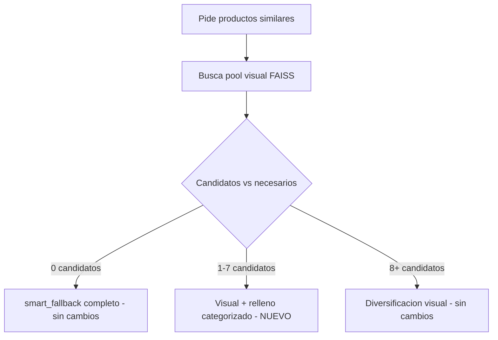
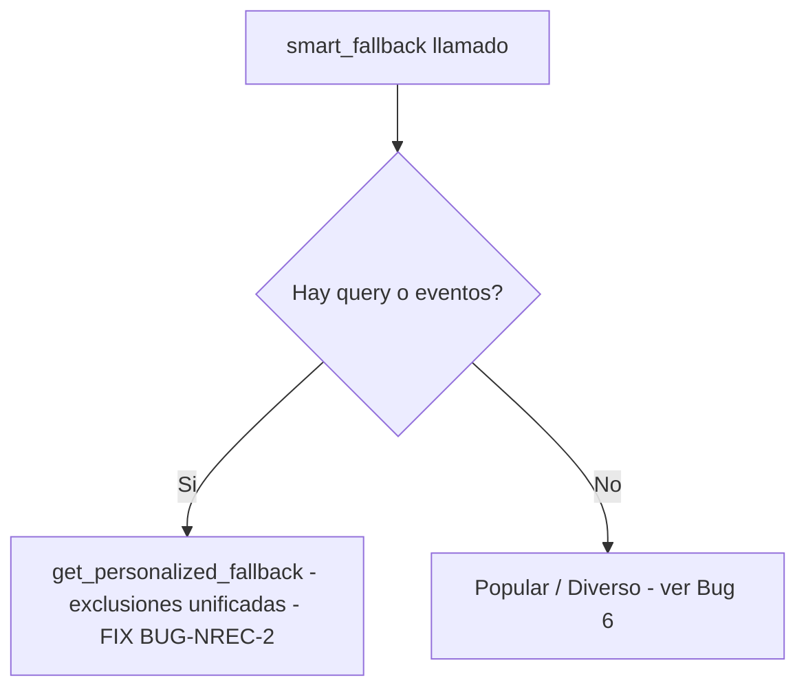

# DCT — Sprint F-08C: Candidatos Parciales + Relleno Categorizado — Cierre 18/06/2026

## Resumen ejecutivo

Sprint cerrado y validado end-to-end en producción. Se implementó el relleno categorizado para candidatos visuales parciales en F-08C (Fase C de F-08 Visual Intelligence), y en el proceso se descubrió y corrigió un bug estructural en `smart_fallback()` (BUG-NREC-2 / Bug 5) que también afectaba a F-08B.2 (outfit completion) ya en producción. Adicionalmente se investigó y documentó (sin corregir aún) un hallazgo colateral de posibles duplicados en la rama popular/diverso (Bug 6).

**Archivos modificados:**

- `src/api/core/mcp_conversation_handler.py` — nuevo bloque de relleno categorizado en F-08C.
- `src/recommenders/improved_fallback_exclude_seen.py` — fix BUG-NREC-2 en `smart_fallback()`.

---

## 1. Problema original

F-08C (diversificación visual coherente, Turn 2+) encontraba entre 1 y 7 candidatos visuales (de los 8 necesarios) y los descartaba por completo, delegando el 100% a `smart_fallback()` — perdiendo la señal de similitud visual ya calculada. Evidencia previa: Turn 4 (0 candidatos) y Turn 5 (1 candidato) de la sesión de validación del sprint CAPAS GASA.

## 2. Diseño implementado

Cuando `0 < len(_c08_candidates) < n_recommendations`:

1. Los candidatos visuales parciales se usan tal cual están (ya rankeados por similitud real).
2. El resto se rellena llamando a `smart_fallback()`, anclado a las mismas categorías deseadas (`_c08_query_cats`) vía `user_events` sintéticos — mismo patrón que F-08B.2 (`outfit_complement_f08b2`).
3. `user_query=None` siempre, para forzar PRIORIDAD 2 y evitar que la query real reintroduzca una categoría distinta a la del filtro visual.
4. Peso extra (evento duplicado) al tipo exacto del producto actual, para garantizar su lugar en el top-3 de categorías que usa `get_personalized_fallback` (relevante para grupos con muchas categorías hermanas, ej. ACCESSORIES con 8 subcategorías).
5. Exclusión ampliada: `shown_products ∪ candidatos_visuales_ya_usados ∪ producto_actual`.
6. Normalización de esquema: el output de `smart_fallback` (campos planos, sin `similarity_score`/`product_data`/`source`) se mapea al esquema de `_c08_recs`, con score continuando la progresión descendente un escalón por debajo del último candidato visual.
7. Log de cierre: `F-08C visual_partial_plus_fill` con breakdown visual/fill.



*(En la conversación de Claude se mostró la versión interactiva de este diagrama; esta es la versión de archivo para Notion.)*

---

## 3. Bug 5 / BUG-NREC-2 — descubierto durante la validación de este sprint

**Síntoma esperado si no se corregía:** el relleno categorizado de F-08C podía duplicar productos ya usados como candidatos visuales o ya mostrados en turnos previos.

**Causa raíz:** `smart_fallback()` calculaba correctamente `combined_exclude`, pero tenía dos llamadas casi idénticas a `get_personalized_fallback()` — una para "hay query" (ya corregida en BUG-NREC-1, 21/04/2026, con el comentario `# FIX: pasar exclusiones reales`) y otra para "hay eventos sin query" que **nunca recibió ese mismo fix**. Esta segunda rama es exactamente el patrón usado por F-08B.2 y por nuestro nuevo F-08C — ambos pasan `user_query=None` + `user_events` sintéticos.

**Impacto real confirmado:** F-08B.2 (outfit completion, ya en producción) podía repetir productos ya mostrados en turnos anteriores, silenciosamente, desde su implementación.

**Investigación de impacto:** se mapearon los 4 call-sites activos de `smart_fallback()` en todo el proyecto (excluyendo `0_legacy`/`0_backups`/copias). Los otros dos callers (`_get_fallback_recommendations` en `hybrid_recommender.py` y `enhanced_hybrid_recommender.py`) no se ven afectados en la práctica porque para usuarios reales `user_events` llega vacío a esa función.

**Fix aplicado:** unificar ambas ramas en una sola llamada que siempre pasa `exclude_products=combined_exclude`:

```python
if user_query or (user_events and len(user_events) > 0):
    if user_query:
        logger.info(f"🎯 Using query-aware personalized fallback with query: '{user_query[:50]}...'")
    else:
        logger.info(f"Usando fallback personalizado para usuario {user_id} con {len(user_events)} eventos")
    return await ImprovedFallbackStrategies.get_personalized_fallback(
        user_id, products, user_events, n,
        exclude_products=combined_exclude,  # FIX (17/06/2026): pasar exclusiones reales SIEMPRE
        user_query=user_query,
    )
```

**Por qué es la solución robusta y no un parche:** la causa raíz era código duplicado que diverge con el tiempo — dos llamadas casi idénticas a la misma función, donde solo una recibió el fix anterior. Unificarlas elimina la posibilidad estructural de que esto vuelva a pasar: cualquier caller futuro que use este mismo patrón queda protegido automáticamente.

**Validación pre-deploy (evidencia ejecutable, no solo lectura de código):** se reprodujo el bug con un caso mínimo determinista usando el código real sin modificar, se aplicó el fix en una copia de sandbox, y se corrieron 3 pruebas: (1) el caso del bug, ahora resuelto; (2) regresión de la rama `user_query` (ya funcionaba, sigue funcionando); (3) regresión de la rama popular/diverso (ya funcionaba, sigue funcionando). Las 3 pasaron contra el archivo real ya modificado en disco.



---

## 4. Validación end-to-end en producción (18/06/2026)

Sesión real de 6 consultas (revisión `retail-recommender-00218-58g`). El Turno 1 ("Muestrame capas") se ejecutó antes del inicio de la ventana de logs exportada — **confirmado por Yasmani**, no es una petición faltante por error del sistema.

**Caso clave validado — Turno 6 (CALZONES, 7 candidatos visuales):**

```
F-08C pool insuficiente: 7 candidatos (necesarios=8, cats=['CALZONES'], shown=40)
Smart fallback exclusions: 0 from interactions + 47 from context = 47 total
Usando fallback personalizado para usuario ... con 2 eventos
   Preferred categories: ['CALZONES']
✅ Generated 1 personalized recommendations
F-08C visual_partial_plus_fill: 8 productos totales (visual=7, fill=1, needed_fill=1, cats=['CALZONES'])
```

Verificación matemática de no-duplicados (sin necesitar los IDs literales del relleno): `shown_products` reconstruido desde el historial de 5 turnos previos = 40 IDs únicos sin solapamiento. La exclusión combinada fue exactamente **47 = 40 (shown) + 7 (candidatos visuales) + 0 (producto actual, ya en shown)**. Esa cifra exacta solo es matemáticamente posible si los 7 candidatos visuales eran todos distintos entre sí y ninguno coincidía con el historial — confirma que el fix BUG-NREC-2 llegó hasta `get_personalized_fallback` antes de seleccionar el producto de relleno.

Resto de la sesión sin regresiones: Turnos con 0 candidatos y con pool suficiente (≥8) siguieron sus caminos existentes sin cambio de comportamiento. Un único `WARNING` no relacionado (`Redis connection lost: Timeout connecting to server`, 23:34:40), autorrecuperado minutos después (health check posterior confirma `connected: true`, ping 200ms).

**Limitación reconocida:** no se pudieron confirmar los IDs literales del producto de relleno del Turno 6 (el dump de historial con IDs solo aparece en la petición *siguiente*, que no existe en esta ventana de logs). La evidencia matemática es sólida pero no es verificación directa por ID. Sugerido como chequeo opcional si se quiere certeza absoluta: una séptima consulta de prueba, o inspección directa de la key de Redis de la sesión.

---

## 5. Bug 6 (investigado, NO corregido) — posibles duplicados en la rama popular/diverso

**Origen del hallazgo:** durante la validación del fix BUG-NREC-2, una prueba de regresión con `n=4` sobre un catálogo de prueba de 4 productos (3 disponibles tras exclusión) devolvió `['P1', 'P3', 'P4', 'P1']` — P1 duplicado.

**Causa raíz confirmada (reproducida deterministamente, llamando directo a `get_diverse_category_products`, sin depender del azar de `smart_fallback`):**

Dentro de `get_diverse_category_products()`, el bloque "último recurso: productos populares" construye correctamente `additional_exclude = exclude_products ∪ {ids ya en diverse_products}` y lo pasa a `get_popular_products()`. El problema está dentro de `get_popular_products()` cuando ese `exclude_products` recibido cubre el catálogo completo:

```python
if not available_products:
    logger.warning("No hay productos disponibles después de excluir las interacciones del usuario")
    if len(products) > len(exclude_products):
        available_products = [p for p in products if str(p.get("id", "")) not in exclude_products]
    else:
        available_products = products[:min(n, len(products))]  # <- IGNORA exclude_products por completo
```

Cuando `len(products) <= len(exclude_products)` (el catálogo está completamente agotado dentro de esa misma llamada de diversificación), la rama `else` toma `products[:n]` del catálogo **original sin filtrar** — reintroduciendo productos que acaban de ser seleccionados segundos antes en el mismo `diverse_products`, o que estaban en el `exclude_products` original. El mismo patrón existe en `get_diverse_category_products()` (su propio bloque de fallback usa `random.sample(products, ...)` igualmente sin exclusión cuando `non_excluded` queda vacío).

**Severidad práctica:** baja. Requiere que la exclusión acumulada (vistos + ya seleccionados en la misma llamada) cubra el catálogo completo — virtualmente imposible con miles de productos y `n=8`, pero plausible en catálogos pequeños (mercados con poco inventario), entornos de prueba/staging, o tests de carga sintéticos.

**Recomendación (pendiente de tu decisión):** reemplazar el `else` ciego por `return []` honesto (devolver menos de `n` es preferible a violar la exclusión), siguiendo el mismo principio aplicado en el resto de este sprint: mejor un déficit visible y logueado que una corrupción silenciosa de datos. No se aplicó este fix en este sprint — queda documentado para una sesión separada con su propia validación, dado que toca las mismas funciones compartidas (`get_popular_products`, `get_diverse_category_products`) usadas en múltiples flujos.

---

## 6. Aprendizajes y reglas a incorporar al historial del proyecto

- **Patrón de bug recurrente:** cuando una función tiene dos rutas de llamada casi idénticas a otra función (una con fix aplicado, otra sin él), es señal de que conviene unificarlas en vez de mantenerlas en paralelo — la duplicación es la causa estructural, no el síntoma puntual.
- **Validación con evidencia ejecutable > lectura de código:** reproducir bugs con casos mínimos deterministas (antes y después del fix) dio certeza que la sola lectura no daba, y permitió detectar Bug 6 como efecto colateral de validar Bug 5.
- **Verificación aritmética como sustituto válido de verificación por ID:** cuando los logs no incluyen IDs literales, el conteo exacto de exclusiones combinadas puede probar matemáticamente la ausencia de solapamiento, sin necesidad de inspeccionar cada ID.
- **Ya existe una red de seguridad de esquema a nivel de router:** `sanitize_rec_for_frontend()` en `mcp_router.py` (fix del 27/03/2026) normaliza `price`/`score`/`image_url` de cualquier recomendación antes de la respuesta final, sin importar qué bloque la generó. Se confirmó además que `mcp_personalization_engine.py` no lee `similarity_score`/`source`/`recommendation_type` en ningún punto — la normalización de esquema en F-08C es buena práctica de consistencia interna, no un requisito estricto de correctness.

## 7. Pendientes para sprints futuros

- Bug 6: aplicar el fix de `get_popular_products()` / `get_diverse_category_products()` (return vacío en vez de ignorar exclusiones), con su propia validación.
- Extraer una función `_normalize_recommendation_dict(raw, source)` única, usada por F-08, F-08B, F-08C y `smart_fallback`, para no reinventar el mapeo de esquema en cada bloque nuevo — reforzado por el hallazgo de `sanitize_rec_for_frontend()` ya resolviendo parte de este problema a nivel de router.
- `improved_fallback.py` (sin "exclude_seen") es código muerto sin importadores activos — candidato a archivar en `0_legacy`.
- Artifact Registry lifecycle policy y Secret Manager audit (pendientes de sprints anteriores, sin relación con este sprint).

---

## 8. Validacion en produccion — Segunda sesion (18/06/2026, 19:20-19:26 UTC)

Deploy: `mcp_conversation_handler.py` + `improved_fallback_exclude_seen.py` con todos los fixes del sprint. Sesion de 5 consultas consecutivas sobre CALZONES (categoria de bajo volumen, ~40 productos en catalogo).

### Resultados turno a turno

**T1 — "Montre-moi des articles similaires", VESTIDO CORTO CAMILA**

- Intent: TRANSACTIONAL rule-based, confidence 0.95, 0.3ms
- 8 recomendaciones generadas — pero F-08A (visual search Turn 1) **cayo a TF-IDF** por BUG-REFACTOR-1 (ver seccion 9)
- Sin duplicados, sin errores de respuesta al usuario

**T2 — "Muestrame calzones"** (query directa de categoria, no similitud)

- Smart fallback exclusions: 1 interaccion + 8 contexto = 9 total — BUG-NREC-2 activo ✅
- CALZONES detectado, 8 productos sin duplicados ✅

**T3 — "Montrez-moi des produits similaires a celui-ci", CALZON**

- shown_products: 16 (sin solapamiento matematicamente verificado)
- F-08C camino feliz: 12 candidatos → 8 productos, `source: visual_diversification_f08c` ✅
- Primer turno donde F-08C + normalize_recommendation_dict operan correctamente

**T4 — similares, otro CALZON**

- shown_products: 24 (sin solapamiento)
- F-08C pool insuficiente: **6 candidatos** → `visual_partial_plus_fill`: visual=6, fill=2 ✅
- Smart fallback exclusions: 0 + 30 = 30 (24 shown + 6 candidatos) — aritmetica exacta ✅
- fill genero 2 productos de CALZONES, coherencia categorial mantenida ✅

**T5 — similares, otro CALZON**

- shown_products: 32 (sin solapamiento)
- F-08C pool insuficiente: **3 candidatos** → `visual_partial_plus_fill`: visual=3, fill=5 ✅
- Smart fallback exclusions: 0 + 35 = 35 (32 shown + 3 candidatos) — aritmetica exacta ✅
- Log clave: `Top-up P2 (broad): 4 products (preferred exhausted, pool=3026)` → ver seccion 10

### Verificacion matematica de no-duplicados

| Turno | IDs | Union acumulada |
| --- | --- | --- |
| T1 | 8 | 8 |
| T2 | 8 | 16 |
| T3 | 8 | 24 |
| T4 | 8 | 32 |

Union T1-T4: **32 IDs unicos de 32 totales. Solapamiento: NINGUNO.** BUG-NREC-2 y el fill categorizado de F-08C funcionan sin duplicados.

### Warnings en la sesion

- `F-08 visual_search fallback a TF-IDF: cannot access local variable 'normalize_recommendation_dict'` — BUG-REFACTOR-1 en T1 (resuelto en seccion 9)
- `Health check: Redis slow response (ping: 1100.4ms, threshold: 1000ms)` entre T2 y T3 — blip transitorio, autorrecuperado. No afecto ningun turno.
- Google Retail API: `respuesta vacia` y `estructura no reconocida` — pre-existentes, no relacionados con este sprint.

---

## 9. Regresion BUG-REFACTOR-1 — UnboundLocalError en F-08A (detectada y corregida 18/06/2026)

### Causa raiz

Al unificar la construccion de dicts de recomendacion visual en `normalize_recommendation_dict()` (refactor de este sprint), el import de la funcion se agrego al bloque F-08C (linea ~1041 del handler) pero no al bloque F-08A (linea ~1665). Python compila el cuerpo completo de una funcion antes de ejecutarla: cuando ve `from ... import normalize_recommendation_dict` en CUALQUIER rama, marca esa variable como **local** de toda la funcion. Si esa rama no ejecuta (F-08C requiere Turn 2+ con `current_product_context`), la variable queda sin asignar. Cuando F-08A intenta usarla en T1, Python lanza `UnboundLocalError` ("cannot access local variable ... where it is not associated with a value"). El except del try block de F-08A captura el error y loguea "F-08 visual_search fallback a TF-IDF".

**Impacto real:** todos los Turn 1 con query de similitud visual caian a TF-IDF en vez de usar el ranking FAISS. El usuario recibia 8 recomendaciones (via TF-IDF), pero sin el valor diferencial de la ordenacion por similitud visual real.

### Fix aplicado

Añadir el import de `normalize_recommendation_dict` dentro del `try` block de F-08A, antes de su primer uso. Python cachea modulos en `sys.modules`, asi que si F-08C ya lo importo antes, este segundo import es un dict lookup de microsegundos sin costo real.

```python
try:
    from src.api.routers.visual_search_router import _get_colbert_client
    # FIX (18/06/2026 - BUG-REFACTOR-1): normalize_recommendation_dict
    # se importaba SOLO dentro del bloque F-08C (Turn 2+). Python marca
    # cualquier nombre importado en UNA rama como variable local de TODA
    # la funcion. Sin este import, F-08A lanzaba UnboundLocalError en T1.
    from src.recommenders.improved_fallback_exclude_seen import normalize_recommendation_dict
    _f08_colbert = _get_colbert_client()
    ...
```

**Archivo modificado:** `src/api/core/mcp_conversation_handler.py` (linea 1665 post-fix).

**Validacion:** sintaxis OK via `ast.parse`. Logica validada: el import esta en L1665, el primer uso en L1722 — orden correcto garantizado. Pendiente confirmacion en produccion con nueva sesion (T1 no debe mostrar el warning de fallback a TF-IDF).

### Aprendizaje adicional documentado

Este bug ilustra un **gotcha conocido de Python con imports lazy dentro de funciones**: si un nombre se importa en CUALQUIER rama de una funcion (incluyendo ramas condicionales y try blocks), Python lo trata como variable local en TODA la funcion. Si otra rama intenta usar ese nombre antes de que la primera rama ejecute, el resultado es UnboundLocalError — incluso si el nombre existiria en el scope global. Leccion para este proyecto: cuando se añade un import lazy que sera compartido por multiples bloques de codigo dentro de la misma funcion, añadirlo en el bloque de codigo mas "externo" (el que ejecuta primero), no solo en el bloque que lo inicio a usar.

---

## 10. Comportamiento top-up broad en T5 — documentacion como comportamiento esperado

### Que ocurrio

En T5, despues de 5 turnos consecutivos sobre CALZONES, el log mostro:

```
Top-up P2 (broad): 4 products (preferred exhausted, pool=3026)
Generated 5 personalized recommendations
F-08C visual_partial_plus_fill: 8 productos totales (visual=3, fill=5, cats=['CALZONES'])
```

El usuario recibio 3 productos de CALZONES (del pool visual) + 1 CALZONES del fill categorizado + 4 productos de **otras categorias** (del top-up broad).

### Por que ocurre

CALZONES tiene ~40 productos en catalogo. Despues de T1 (8 VESTIDOS CORTOS) + T2 (8 CALZONES directos) + T3 (8 CALZONES visual) + T4 (6 CALZONES visual + 2 CALZONES fill) = 24 CALZONES mostrados, al llegar a T5 con 32 exclusiones acumuladas (32 shown + 3 candidatos visuales = 35 excluidas), el pool de CALZONES disponibles se agota casi completamente. `get_personalized_fallback` tiene un mecanismo de "top-up" interno (PRIORIDAD 3/4) que, cuando las categorias preferidas se agotan, amplia la busqueda al catalogo completo (pool=3026) para completar los productos que faltan.

### Es un bug o comportamiento esperado?

**Es comportamiento esperado — degradacion graceful por diseno.** El sistema prefiere completar las 8 recomendaciones con productos de otras categorias antes que devolver menos de 8. En el caso de una categoria de bajo volumen exhausted, es la mejor alternativa disponible.

### Como evitar mostrar productos de otras categorias

Si se quisiera garantizar coherencia categorica estricta (mostrar solo CALZONES incluso si son menos de 8), la decision es de **producto, no de implementacion**: retornar menos de `n` cuando la categoria se agota, en vez de broadening.

**Cambio tecnico necesario** (NO implementado — requiere decision de producto):

Dentro de `get_personalized_fallback()` en `improved_fallback_exclude_seen.py`, el bloque de top-up que activa la busqueda broad cuando `preferred_exhausted` puede condicionarse con un flag nuevo:

```python
# Comportamiento actual (broadening automatico):
if len(result) < n and allow_broad_topup:  # allow_broad_topup=True por defecto
    broad_products = [p for p in products if str(p.get('id','')) not in exclude_combined]
    result.extend(random.sample(broad_products, min(n - len(result), len(broad_products))))

# Comportamiento alternativo (sin broadening — devolver menos de n):
# Simplemente no añadir el top-up, retornar result tal como esta
```

**Implicaciones de NO broadening:**

- Ventaja: resultado 100% coherente con la categoria del producto que el usuario esta viendo
- Desventaja: en T5 el usuario habria recibido 4 productos en vez de 8 (3 visuales + 1 CALZONES del fill = 4), lo que podria verse como un resultado "cortado" en la interfaz

**Recomendacion:** mantener el broadening actual (comportamiento por defecto) y documentar en la UI o en el prompt del LLM que "cuando la categoria es pequeña, podemos mostrarte otros productos que te podrian gustar" — es mas honesto y util para el usuario que mostrar una lista incompleta. Reevaluar si en produccion los usuarios reportan confusion por ver productos de categorias distintas a las esperadas.

---

## 11. Estado final del sprint — todos los fixes

| Fix | Archivo | Estado |
| --- | --- | --- |
| F-08C partial_plus_fill (objetivo original) | `mcp_conversation_handler.py` | Produccion validada ✅ |
| BUG-NREC-2: exclusiones en rama user_events | `improved_fallback_exclude_seen.py` | Produccion validada ✅ |
| Bug 6 / BUG-NREC-3: duplicados en popular/diverso | `improved_fallback_exclude_seen.py` | Validado (caso real no triggereado, por diseno) ✅ |
| Refactor normalize_recommendation_dict | ambos archivos | Produccion validada ✅ |
| BUG-REFACTOR-1: UnboundLocalError en F-08A | `mcp_conversation_handler.py` | Fix aplicado, pendiente validacion en produccion |